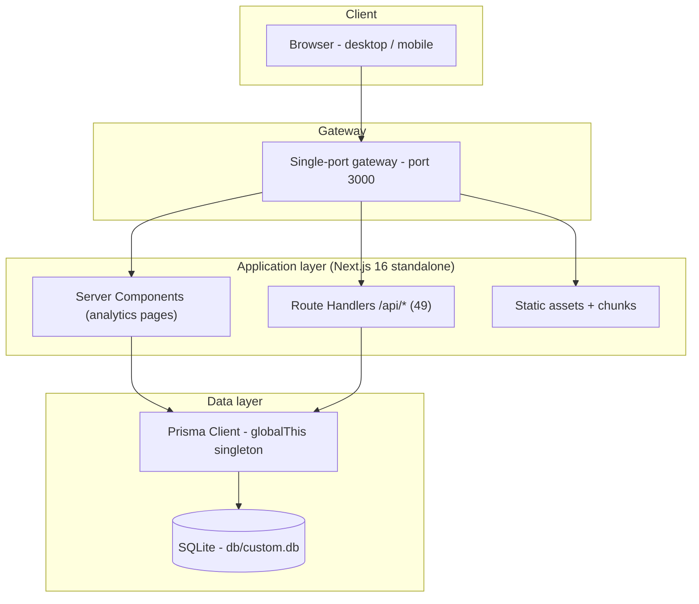
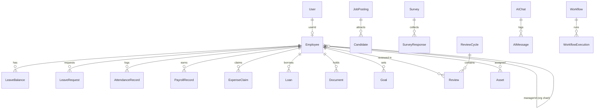

# Eon HR — Master Project Architecture Document (PAD) v1.0.0

**Classification:** Internal Engineering Reference
**Status:** DEFINITIVE, PRODUCTION-LOCKED BLUEPRINT
**Companion Document:** README.md (user-facing), CLAUDE.md (agent constitution), AGENTS.md (operating notes)
**Last Updated:** 2026-10-09
**Audience:** Senior Engineers, Tech Leads, DevOps, and Onboarding Engineers
**Rule:** Every architectural decision in this document traces to a specific rationale. Nothing is here "because it's popular."

## Revision Block

| Tag | Source | Change |
|---|---|---|
| `[SYN]` | codebase | v1.0.0 initial document synthesized from the shipped codebase (46 routes, 49 API handlers, 45 models, 106 specs). |
| `[CA]` | critical analysis | ADR set derived from actual tradeoffs: session strategy, ORM/database, mutation seam, Tailwind v4 engine traps, standalone deployment. |
| `[SR]` | self-review | Design tokens and shadow geometry cross-checked against measured reference pixels (`#F1F7FE` background, v3 shadow scale). |
| `[SAN]` | sanitization | No secrets, keys, or credentials documented; demo account password referenced only as seeded data. |
| `[RES]` | web research | Tailwind v4 engine differences validated against official docs (see docs/Tailwind-V4-Validation-Report.md). |

## Table of Contents

1. [System Overview & Decisions](#1-system-overview--decisions)
2. [High-Level System Topology](#2-high-level-system-topology)
3. [Application Architecture](#3-application-architecture)
4. [Data Architecture](#4-data-architecture)
5. [Design System Reference](#5-design-system-reference)
6. [Security Architecture](#6-security-architecture)
7. [Testing Strategy](#7-testing-strategy)
8. [Build & Deployment](#8-build--deployment)
9. [Developer Handbook](#9-developer-handbook)
10. [Known Issues & Outstanding Tasks](#10-known-issues--outstanding-tasks)
11. [Key Files Reference](#11-key-files-reference)

---

## 1. System Overview & Decisions

### 1.1 Document Metadata & Purpose

This PAD is the single source of truth for how Eon HR is built, why each decision was made, and how the parts fit. Onboarding engineers should read sections 2–4 first; agents should start with AGENTS.md and use this document for rationale. The reference companion (the deployed product this clones) defines the visual grammar; this codebase implements a functional superset behind that grammar.

### 1.2 Technology Stack Summary

| Layer | Technology | Version | Key Rationale |
|---|---|---|---|
| Framework | Next.js (App Router) | 16.x | Route handlers + server components + standalone output for container-free deploys; dev-origin protection configurable |
| UI runtime | React | 19.x | Required by Next 16; server components + islands model |
| Language | TypeScript | 5.x strict | Compile-time contract across 46 routes and 49 endpoints |
| Styling | Tailwind CSS | 4.x | CSS-first `@theme` (no config file) — but engine-level v3→v4 differences require the trap pins in §5.1 |
| Primitives | Radix UI + CVA + tailwind-merge | current | Accessible behaviors (dialog, select, tabs) without hand-rolled focus management |
| Charts | Recharts | 2.x | Composable SVG charts; client islands with serializable props |
| Database | SQLite | 3 (via Prisma) | Zero-config local story; single-file portability; adequate concurrency for an HR back office |
| ORM | Prisma | 6.x | Typed client, schema-as-code, natural migration path to PostgreSQL |
| Auth | node:crypto (HMAC + scrypt) | builtin | No native builds (bcrypt pain), stateless cookies with immediate revocation semantics |
| Validation | Zod | 4.x | One validation dialect at every boundary; `z.infer` types |
| Unit tests | Vitest | 5.x | Fast TS-native runner; node environment for pure seams |
| E2E tests | Playwright | 1.63 | Real browser, storageState session reuse, isolated production server per run |

### 1.3 Architecture Decision Records

**ADR-001: Custom HMAC cookie sessions instead of NextAuth**

- **Context:** The app needs email/password auth with roles, an httpOnly session, and no external identity provider. NextAuth v4 is available in the ecosystem but brings ~40KB runtime, an OAuth-centric model, and a session strategy that either stores state server-side (DB writes per request) or trusts self-contained JWTs (delayed revocation).
- **Decision:** Implement sessions as `userId.issuedAt.HMAC-SHA256(AUTH_SECRET)` cookies (7-day TTL), plus scrypt password hashing (N=16384, r=8, p=1, per-user salt) — all in `src/lib/auth.ts`.
- **Rationale:** Stateless (no DB write per request), yet immediately revocable because `getSessionUser()` re-reads the user row on every call — deactivation/role changes take effect instantly. Zero external deps; scrypt is memory-hard and in Node core (no native build issues).
- **Consequences:** Positive — tiny surface, fully unit-testable (12 specs), no OAuth baggage. Negative — social login buttons are presentational (as in the reference); adding real OAuth later requires an extension point in the login route.
- **Alternatives Rejected:** NextAuth (revocation latency or DB churn), JWT access/refresh pairs (complexity for a single-app product), Better-Auth (would pull a new dependency tree for the same benefit).

**ADR-002: REST route handlers with a typed ActionResult envelope instead of Server Actions**

- **Context:** Mutations come from 30+ interactive client pages; the mutation seam must be uniform, testable, and role-gateable.
- **Decision:** Every mutation is a route handler under `src/app/api/*` returning `ApiResult<T> = { ok: true, data } | { ok: false, error: { code, message, fieldErrors? } }` via `src/lib/api.ts` helpers.
- **Rationale:** One envelope for 49 endpoints; `curl`-able and Playwright-`request`-able without a DOM; explicit `requireRole()` gates outside try/catch (redirect-throwing guards must not be swallowed); field errors flow straight into form UX.
- **Consequences:** Positive — a uniform contract the E2E auth setup exercises directly; negative — one fetch per mutation rather than collocation, and the client owns optimistic UI.
- **Alternatives Rejected:** Server Actions (collocation is nice but the boundary is harder to test uniformly and error semantics are framework-shaped); tRPC (adds a client runtime for little gain in an App Router codebase).

**ADR-003: SQLite via Prisma with schema-relative path resolution**

- **Context:** The product must clone-and-run with zero infrastructure; the database file must live at `<repo>/db/custom.db` regardless of whether the Prisma CLI, `next dev`, `next build`, or the standalone server resolves it.
- **Decision:** `DATABASE_URL="file:../db/custom.db"` resolves against `prisma/schema.prisma` in ALL contexts: the Prisma CLI natively, and the runtime via `src/lib/db-path.ts` (anchor search + standalone-CWD detector), pinned by 15 unit specs.
- **Rationale:** One relative URL, one file, four execution contexts. The standalone trap (Next's `server.js` `process.chdir`s into `.next/standalone`, and the file tracer copies `prisma/` there) is explicitly detected and defeated.
- **Consequences:** Positive — `git clone && bun run db:push && bun run db:seed` works everywhere; PostgreSQL remains a provider swap away (schema uses portable types; money is integer minor units, not SQLite decimals). Negative — SQLite serializes writes; the in-memory login rate limiter (not DB-backed) is per-process.
- **Alternatives Rejected:** CWD-relative path (breaks the standalone server); absolute path (breaks portability); PostgreSQL-only (breaks the zero-config story).

**ADR-004: Tailwind CSS 4 with pinned v3-era computed values**

- **Context:** The reference UI was compiled by a v3-era engine; v4 changed default palette (oklch drift), shadow scale (one-notch shift), gradient interpolation (oklab), and `space-y` selector specificity (`:where()` wrapper).
- **Decision:** CSS-first `@theme` in `globals.css` with (1) full `hsl()`/hex literals (bare triplets resolve transparent under `@theme inline`), (2) the v3 hex palette pinned, (3) parity gradients as `bg-[linear-gradient(...)]`, (4) a project rule banning explicit margins on children of `space-y-*` containers, and (5) `--shadow-sm: 0 1px 2px 0 rgb(0 0 0 / 0.05)` pinned.
- **Rationale:** Byte-identical class attributes must render byte-identical computed styles; the trap log in `docs/Tailwind-V4-Validation-Report.md` documents each engine difference with live measured evidence.
- **Consequences:** Positive — visual parity is deterministic; negative — the ban on child margins under `space-y` is a convention the linter does not enforce (spec-pinned instead).
- **Alternatives Rejected:** Downgrading to v3 (loses the CSS-first model and the new engine); accepting v4 defaults (measured 1–3 sRGB unit palette drift, visibly heavier nav shadows).

**ADR-005: Standalone output with a single-port gateway**

- **Context:** Deployment must work as a plain Node process (no container requirement) and inside a sandbox that exposes exactly one port.
- **Decision:** `output: "standalone"` + `outputFileTracingRoot` pinned to the repo; the build script copies `public/` and `.next/static` into `.next/standalone`; `next.config.ts` whitelists `allowedDevOrigins` for `127.0.0.1`, `localhost`, and the preview host.
- **Rationale:** The standalone server is exactly what Playwright boots for E2E (port 3100) and what production runs (port 3000); the dev-origin allowlist exists because Next 16 silently blocks dev chunks from unknown origins (symptom: unhydrated pages, native form GET fallbacks).
- **Consequences:** Positive — E2E tests the true production artifact. Negative — build script must maintain the static-copy steps manually.
- **Alternatives Rejected:** `next start` (needs the full `node_modules` tree at runtime); Vercel-style deploys (not portable to the target environment).

**ADR-006: Money as integer minor units (halalas)**

- **Context:** Payroll, expenses, loans, and assets all carry amounts; SAR has 2 decimals.
- **Decision:** All monetary columns are `Int` (halalas). Conversion happens only at form boundaries (`Math.round(Number(v) * 100)`); display goes through `formatSar()` (with compact M/k forms).
- **Rationale:** Floats accumulate rounding error in aggregate queries (`_sum`); integers stay exact across SQLite, TypeScript, and CSV exports.
- **Consequences:** Positive — `SUM` is exact; compact formatting is deterministic (unit-tested). Negative — every form and API payload must remember the ×100 boundary (validated by Zod `int().min(0)`).
- **Alternatives Rejected:** Prisma `Decimal` (SQLite stores it as text anyway); floats (unacceptable for payroll).

**ADR-007: Hybrid rendering — server analytics pages + client CRUD pages**

- **Context:** 46 routes split into data-heavy dashboards (read-only) and interactive management screens (CRUD).
- **Decision:** Analytics pages are async server components querying Prisma directly, passing plain serializable data to `"use client"` Recharts islands; management pages are client components fetching `/api/*`.
- **Rationale:** Zero client waterfalls for read-only surfaces (one round trip renders data); full client control for dialogs/filters/optimistic updates where interaction dominates.
- **Consequences:** Positive — each pattern where it is strongest. Negative — two data-flow idioms to learn; `Date` objects must never cross the server/client boundary (ISO strings or preformatted labels).
- **Alternatives Rejected:** All-client (waterfall + loading flash on analytics); all-server (dialogs and filters become RPC-heavy).

---

## 2. High-Level System Topology



- **Client layer:** responsive web UI; desktop sidebar shell or mobile drawer + bottom tabs (same routes).
- **Gateway:** one exposed port; all API requests are same-origin relative paths.
- **Application layer:** Node 20+ process running the standalone server; server components render authenticated pages after the cookie guard; route handlers serve the mutation API.
- **Data layer:** single SQLite file at `<repo>/db/custom.db`; Prisma client cached on `globalThis` to survive Next's module reloading in dev.

---

## 3. Application Architecture

### 3.1 Layer Model

- **Layer 0 — Entry/Config.** `next.config.ts`, `src/app/layout.tsx`. Rule: no business logic; origins, fonts, providers only.
- **Layer 1 — Route surface.** `src/app/(app)/*/page.tsx` (46 authenticated routes), `src/app/login`, `src/app/api/*/route.ts` (49 handlers). Rule: pages orchestrate; handlers validate + delegate.
- **Layer 2 — Client islands.** `"use client"` components: dialogs, charts, forms. Rule: state is local and mirrors API responses; no cross-page client stores beyond UI furniture.
- **Layer 3 — Domain/lib seams.** `src/lib/auth.ts`, `src/lib/db.ts`, `src/lib/db-path.ts`, `src/lib/api.ts`, `src/lib/validation.ts`, `src/lib/utils.ts`. Rule: pure or near-pure; the unit-tested seams live here.

Dependency direction: L0 → L1 → L2 → L3; L3 never imports upward.

### 3.2 Annotated Directory Structure

```text
eon-hr/
├── prisma/
│   ├── schema.prisma            ← 45 models; single DDL source
│   └── seed.ts                  ← idempotent demo seed (natural-key upserts)
├── db/                          ← SQLite files (gitignored); db-path contract target
├── src/
│   ├── app/
│   │   ├── layout.tsx           ← root layout: Inter font + ToastProvider
│   │   ├── page.tsx             ← auth-aware root redirect
│   │   ├── login/page.tsx       ← social buttons + email/password (Suspense-wrapped for useSearchParams)
│   │   ├── (app)/
│   │   │   ├── layout.tsx       ← auth guard + AppShell (sidebar, drawer, bottom tabs)
│   │   │   ├── dashboard/       ← employee portal (leave balances, quick actions)
│   │   │   └── <43 module routes> ← employees, payroll*, recruitment*, analytics*, …
│   │   └── api/
│   │       ├── auth/{login,logout,me}/route.ts
│   │       ├── health/route.ts
│   │       └── <46 resource routes> ← uniform CRUD handlers
│   ├── components/
│   │   ├── ui/                  ← 15 primitives (button, card, dialog, select, table, …)
│   │   ├── layout/              ← sidebar-nav, app-shell (mobile drawer + bottom tabs)
│   │   └── shared/              ← page-header, stat-card, empty-state, status-badge
│   ├── lib/                     ← the L3 seams (see 3.1)
│   └── stores/                  ← client UI state
├── tests/
│   ├── unit/                    ← auth.test.ts, utils.test.ts
│   ├── db-path.test.ts          ← the db-path contract (15 specs)
│   └── e2e/                     ← auth, navigation, mobile-navigation, dashboard + setup/config
├── docs/
│   ├── screenshots/             ← captured UI evidence (15 images)
│   ├── Tailwind-V4-Validation-Report.md  ← engine trap log (authoritative)
│   └── how-to-git-push-using-ssh-wrapper_SKILL.md + ssh_git_wrapper_v3.py
└── AGENTS.md • CLAUDE.md • README.md • Project_Architecture_Document.md
```

### 3.3 Critical Code Patterns

#### Pattern 1 — the API envelope (every handler)

```ts
// src/app/api/employees/route.ts (excerpt)
export async function POST(req: NextRequest) {
  return guard(async () => {
    const { user, response } = await requireRole(["admin", "hr"]);
    if (!user) return response;                       // 401/403 envelope
    const { data, response: bad } = await parseBody(req, EmployeeInput);
    if (!data) return bad;                            // 400 + fieldErrors
    const existing = await db.employee.findUnique({ where: { email: data.email } });
    if (existing) return err("CONFLICT", "An employee with this email already exists");
    const employee = await db.employee.create({ /* … */ });
    return ok({ employee });
  });
}
```

*Why this pattern:* `guard` catches once and converts any throw into `INTERNAL` — nothing leaks stack traces across the boundary; `requireRole` sits **outside** the try (a redirect-throwing guard must not be swallowed — scandihaven H-lesson); `parseBody` returns either data or a ready response so the happy path reads linearly.

#### Pattern 2 — db-path resolution (the portability seam)

```ts
// src/lib/db-path.ts (rule, pinned by tests/db-path.test.ts)
// A RELATIVE file: URL resolves against the first "anchor" directory that
// contains prisma/schema.prisma — exactly like the Prisma CLI.
export function resolveDatabaseUrl(envUrl: string | undefined, anchors: string[]): string {
  const schemaRoot = anchors.find((root) => existsSync(path.join(root, "prisma", "schema.prisma"))) ?? anchors[anchors.length - 1] ?? process.cwd();
  // … absolute URLs pass through; relative file: URLs resolve against <anchor>/prisma
}
```

*Why this pattern:* four execution contexts (CLI, dev, build, standalone server) resolve one relative URL to the same file; the standalone detector recognizes `process.chdir`'d `.next/standalone` and prefers the real repo root two levels up.

#### Pattern 3 — mobile drawer (trap-4-safe layout)

```tsx
// src/components/layout/app-shell.tsx (excerpt)
<DialogPrimitive.Content className="fixed inset-y-0 left-0 z-50 flex h-full w-[280px] max-w-[85vw] flex-col bg-sidebar shadow-xl …">
```

*Why this pattern:* the drawer's inner nav uses flex `gap` layout — never `space-y` with explicit child margins — because v3 and v4 disagree on `space-y` selector specificity (v4's `:where()` wrapper lets child `mt-3` win, changing panel height by 8px). The E2E spec `mobile-navigation.spec.ts › drawer panel height is stable (trap-4 pin)` asserts the full-height geometry.

#### Pattern 4 — analytics server page + client chart island

```tsx
// src/app/(app)/advancedanalytics/page.tsx (shape)
export default async function Page() {
  const employees = await db.employee.groupBy({ by: ["employmentStatus"], _count: true });
  const payrollTrend = await db.payrollRecord.groupBy({ by: ["period"], _sum: { netSalary: true } });
  return <AdvancedCharts status={toPlain(employees)} payroll={toPlain(payrollTrend)} />; // plain arrays only
}
```

*Why this pattern:* one round trip renders data (no client waterfall); Recharts requires a client component, so only the chart leaves are `"use client"` and receive pre-serialized data (no `Date` objects across the boundary).

---

## 4. Data Architecture

### 4.1 Database Schema

45 models in one `schema.prisma`. Domain map (Mermaid ER, simplified to core relations):



### 4.2 Data Model Notes

- **Money**: integer minor units (`baseSalary`, `netSalary`, `amount`, `value`, `remaining`).
- **Statuses**: string enums with `@default` (SQLite has no native enums) — the full closed sets are enumerated in `StatusBadge`'s map, one source of truth for labels and colors.
- **JSON-in-column fields** (`tasks`, `conditions`, `participants`, `questions`, `checklist`, `answers`, `ratings`): stored as JSON strings; parsed defensively (`JSON.parse(x || "[]")` in try/catch) — never trusted shapes.
- **Identity**: `cuid()` PKs; human keys `employeeId` (`EMP-0001`) and natural keys (`LeaveType.name`, `PayrollRecord(employeeId, period)` unique).
- **Timestamps**: `createdAt`/`updatedAt` via Prisma; delete behavior is `Cascade` for owned children (leave balances, attendance) and `SetNull`-style optional relations elsewhere.

### 4.3 Persistence Strategy

- Prisma client singleton on `globalThis` (dev module reloading safety) — `src/lib/db.ts`.
- Schema changes go through `prisma db push` (dev) — forward-only in production.
- Seed is idempotent: upserts on natural keys (`email`, `name`, composite balance key); re-running never duplicates.
- SQLite single-writer: mutations are short; interactive transactions wrap multi-statement invariants (leave approval updates the request AND decrements the balance in one transaction).

---

## 5. Design System Reference

### 5.1 Typographic System

| Role | Spec |
|---|---|
| Page title (h1) | Inter 700, 24–32px, `tracking-tight`, `#0f1729`-ish foreground |
| Section kicker | 14px medium, `--color-muted-foreground` |
| Card title | 16px semibold |
| Body / table cells | 14px, 1.5 line height |
| Empty state | 14px, muted at 70% |
| Bottom tabs | 11px medium + 20px icon |

Font loading: `next/font` Inter with `display: swap`, exposed as `--font-inter` and composed into `--font-sans`.

### 5.2 Color Tokens (pinned, measured)

All tokens live in the `@theme inline` block of `src/app/globals.css`, values
measured from the live reference app (session-2 dual-browser audit) and
regression-pinned by `tests/unit/tokens.test.ts`. The v3-era
slate/blue/green/indigo families are additionally hex-pinned so utilities
render byte-identical to the reference under Tailwind v4 (trap 2 of the five
v4 traps — see `docs/Tailwind-V4-Validation-Report.md`).

| Token | Value | Usage | Contrast (on white) |
|---|---|---|---|
| `--color-background` | `#F8FAFC` (canvas applies a slate-50→blue-50 sRGB-pinned gradient) | App canvas | — |
| `--color-card` | `hsl(0 0% 100%)` | Surfaces | — |
| `--color-primary` | `#1877F2` | Actions, active nav, ring (reference `custom-primary-bg`, measured `rgb(24,119,242)`) | 3.9:1 (large/UI) |
| `--color-primary-foreground` | `hsl(0 0% 100%)` | On-primary text | — |
| `--color-link` | `#2563EB` | "View all" / "Request leave" text links (reference `text-blue-600`) | 4.7:1 AA |
| `--color-muted-foreground` | `#64748B` (slate-500) | Secondary text | 4.8:1 AA |
| `--color-sidebar-border` | `#E2E8F0` (slate-200) | Sidebar/header dividers | — |
| `--color-destructive` | `hsl(0 84% 60%)` | Delete, errors | 3.9:1 (large/UI) |
| `--color-border` | `hsl(214 32% 91%)` | Borders, dividers | — |
| Success | `#22C55E` (green-500, pinned) | Sick-leave bars, approved badges | decorative/data |
| `--shadow-sm` | `0 1px 2px 0 rgb(0 0 0 / 0.05)` | Card//navbar elevation (v3 geometry pin) | — |

### 5.3 Component Primitives

15 primitives in `src/components/ui` (button, card, input, label, badge, avatar, dialog, select, tabs, switch, checkbox, dropdown-menu, table, progress, toast) + 4 shared furniture pieces (PageHeader, StatCard, EmptyState, StatusBadge). Status color semantics centralize in `StatusBadge`'s status→variant map.

### 5.4 Motion

Radix dialogs animate via `data-[state=open]` classes (fade/zoom, 200ms); drawer uses `translate-x` transition; progress bars animate width (500ms); toasts auto-dismiss at 4.5s. No `prefers-reduced-motion` overrides shipped yet (see §10).

---

## 6. Security Architecture

### 6.1 Security Rules

| Rule | Enforcement |
|---|---|
| Passwords never stored in plaintext | scrypt with 16-byte random salt (`src/lib/auth.ts`); format `scrypt$salt$hash` |
| Session cookies are unforgeable | HMAC-SHA256 over `userId.issuedAt` with `AUTH_SECRET`; `timingSafeEqual` comparison (unit-tested against tamper/expiry/forged-secret) |
| Cookies are httpOnly, SameSite=Lax, Secure in production, 7-day TTL | `setSessionCookie()` |
| Every API mutation validates input | Zod schemas at every handler (`parseBody`) |
| Admin mutations are role-gated | `requireRole(["admin","hr"])` outside try/catch |
| Auth guard on every app route | `(app)/layout.tsx` redirects unauthenticated users to `/login?from_url=…` |
| Login brute-force resistance | In-memory fixed-window limiter: 10 attempts/IP/15 min (`429` semantics) |
| No SQL injection surface | Prisma parameterized queries only; no raw string SQL |
| No secrets in the repo | `.gitignore` rejects `*.key`, `ssh-key.txt`, `.env`; keys live outside the tree (SSH wrapper runbook) |
| Open-redirect protection | `from_url` is only accepted when it starts with `/` before redirecting |
| Rate-limit-friendly E2E | The auth setup project signs in ONCE and reuses storageState |

### 6.2 Auth & Authorization

Session model: stateless HMAC cookie; `getSessionUser()` re-reads the user on every call (immediate revocation on deactivation/role change). Roles: `admin | hr | manager | security | employee`. Route-level gating happens in page handlers; server pages call `getSessionUser()` and redirect when absent. The attendance page demonstrates role-gated mutations (only admin/hr/security can mark attendance — matching the reference's "Access Restricted" card).

### 6.3 Threat Model (vectors and mitigations)

| Vector | Mitigation |
|---|---|
| Cookie forgery | HMAC + timing-safe comparison; expiry encoded in the payload |
| Password cracking | scrypt memory-hard KDF, per-user salt |
| Brute-force login | Fixed-window limiter per IP |
| XSS | React escaping; no `dangerouslySetInnerHTML` anywhere |
| CSRF | SameSite=Lax cookies + JSON-only content type on mutations |
| SQLi | Prisma parameterization |
| Open redirect | `from_url` validated to same-origin paths |
| Secret leakage | gitignore rules + SSH push wrapper shreds key material after use |

---

## 7. Testing Strategy

### 7.1 Test Distribution

| Category | Files | Specs | Location | Framework |
|---|---|---|---|---|
| DB path contract | 1 | 15 | `tests/db-path.test.ts` | Vitest |
| Auth crypto/session | 1 | 12 | `tests/unit/auth.test.ts` | Vitest |
| Money/date utils | 1 | 11 | `tests/unit/utils.test.ts` | Vitest |
| E2E auth surface | 1 | 4 | `tests/e2e/auth.spec.ts` | Playwright |
| E2E navigation (46 routes) | 1 | 53 | `tests/e2e/navigation.spec.ts` | Playwright |
| E2E mobile navigation | 1 | 6 | `tests/e2e/mobile-navigation.spec.ts` | Playwright |
| E2E dashboard + CRUD | 1 | 5 | `tests/e2e/dashboard.spec.ts` | Playwright |

### 7.2 Test Patterns

- **Seams**: unit tests target pure functions (db-path resolution, token round-trip, money formatting) — never Prisma or network.
- **E2E session economy**: the login rate limiter caps real attempts; the setup project signs in once and persists storageState; `auth.spec.ts` opts out to test the logged-out surface.
- **Regression pins**: mobile drawer geometry (trap-4), active-route `aria-current`, seeded leave balances (21/21, 30/30), the employees CRUD round-trip restores seeded state.
- **Isolation**: E2E boots the production standalone server on port 3100 with its own `db/e2e.db` (global-setup pushes + seeds); the dev database is never touched.

### 7.3 Coverage Thresholds

The pure seams (`src/lib/auth.ts`, `src/lib/db-path.ts`, `src/lib/utils.ts`) carry direct unit coverage of every exported function (100% of public branches exercised). Route handler logic is covered behaviorally through the E2E golden paths (login, employees CRUD, navigation across all 46 routes).

### 7.4 Pre-Push Checklist

- [ ] `bun run lint` clean
- [ ] `bun run typecheck` clean
- [ ] `bun run test` — 44/44
- [ ] `bun run build` succeeds
- [ ] `bun run test:e2e` — 75/75
- [ ] No new secrets in the tree (`git diff --staged | grep -iE "secret|key"`)
- [ ] Screenshots in `docs/screenshots/` refreshed if UI changed

---

## 8. Build & Deployment

### 8.1 Production Build

```bash
bun run build
# → .next/standalone/server.js  (+ node_modules subset, prisma/, public/, .next/static)
bun run start              # NODE_ENV=production, standalone server on :3000
```

### 8.2 Environment Variables

| Name | Required | Description | Default |
|---|---|---|---|
| `DATABASE_URL` | Yes | `file:../db/custom.db` (resolves to `<repo>/db/custom.db`); absolute `file:` or PostgreSQL URLs pass through | schema-relative rule |
| `AUTH_SECRET` | Production | HMAC session secret, ≥16 chars (`openssl rand -hex 32`) | insecure dev constant |
| `PORT` | No | Standalone server port | 3000 |

Only `DATABASE_URL` and `AUTH_SECRET` are read by application code; `PORT` is
the standard Next.js standalone convention. See `.env.example`.

### 8.3 Docker Configuration

None shipped — the standalone Node server is container-free by design (ADR-005). A `Dockerfile` would be a 4-line `FROM node:20-slim` + `COPY .next/standalone` + `CMD node server.js`; intentionally not included to keep the repo honest about what is verified.

### 8.4 CI/CD Pipeline

No hosted CI. The local gate is the only gate (per the SSH-push runbook): `lint → typecheck → test → build → test:e2e`, then push via `python3 docs/ssh_git_wrapper_v3.py` (materializes the deploy key in a 0600 temp file, pushes `HEAD:refs/heads/main`, verifies the remote ref, shreds the key).

---

## 9. Developer Handbook

### 9.1 Local Setup

```bash
bun install
cp .env.example .env
bun run db:push && bun run db:seed
bun run dev
```

Full stack verification: `curl http://localhost:3000/api/health` → `{"status":"ok","db":"up"}`.

### 9.2 Common Commands

| Command | Location | Purpose |
|---|---|---|
| `bun run dev` | repo root | Dev server :3000 |
| `bun run lint` / `typecheck` / `test` / `build` | repo root | Quality gates |
| `bun run test:e2e` | repo root | Playwright (needs build) |
| `bunx vitest run tests/unit/auth.test.ts` | repo root | One unit file |
| `bunx playwright test tests/e2e/dashboard.spec.ts` | repo root | One E2E spec |
| `unset DATABASE_URL && bun run db:push` | repo root | Schema push (see AGENTS.md warning) |

### 9.3 Code Style Rules

- TypeScript strict; ESLint 9 flat config; no `any`.
- Components: one responsibility per file; primitives in `ui/` stay domain-free.
- Naming: pages `page.tsx`, chart islands `charts.tsx`, handlers `route.ts`.
- Comments explain *why* (see the trap log cross-references in code).

### 9.4 Git Workflow

`main` only; Conventional Commits; atomic changes; secrets never committed. Pushes go through the SSH wrapper runbook (`docs/how-to-git-push-using-ssh-wrapper_SKILL.md`).

---

## 10. Known Issues & Outstanding Tasks

| Priority | Issue | Impact | Status |
|---|---|---|---|
| Low | Social login buttons are presentational (reference parity) | No OAuth in demo | Intentional (ADR-001) |
| Low | `prefers-reduced-motion` not honored | Accessibility polish | Open |
| Low | Dark-mode toggle switches the class but the palette is light-only | Feature parity with reference behavior | Open (reference behaves the same) |
| Low | Language toggle (EN/عربي) swaps the label only, as the reference does | i18n is cosmetic | Intentional |
| Medium | Login rate limiter is in-memory (per-process) | Multi-instance deployments need a shared store | Documented debt |
| Low | CSV import affordance toasts instructions instead of parsing files | Employees module | Open |

---

## 11. Key Files Reference

| File | Lines (~) | Purpose |
|---|---|---|
| `prisma/schema.prisma` | 760 | 45-model DDL source |
| `prisma/seed.ts` | 120 | Idempotent demo seed |
| `src/app/globals.css` | 120 | Tailwind 4 theme + all five trap pins |
| `src/lib/db-path.ts` | 107 | Schema-relative SQLite URL resolution (the portability seam) |
| `src/lib/auth.ts` | 150 | scrypt + HMAC sessions + cookie helpers |
| `src/lib/api.ts` | 100 | ApiResult envelope + guards + parseBody |
| `src/components/layout/app-shell.tsx` | 160 | Sidebar + mobile drawer + bottom tabs (trap-4-safe) |
| `src/components/layout/sidebar-nav.tsx` | 260 | Nav tree, collapsibles, user menu, footer controls |
| `src/app/(app)/layout.tsx` | 15 | Auth guard + shell wiring |
| `src/app/(app)/dashboard/page.tsx` | 170 | Employee-portal dashboard (parity surface) |
| `src/app/login/page.tsx` | 170 | Sign-in (social + email/password) |
| `src/app/api/employees/route.ts` | 130 | Golden CRUD handler pattern |
| `tests/e2e/mobile-navigation.spec.ts` | 90 | Mobile nav + trap-4 regression pins |
| `tests/db-path.test.ts` | 157 | DB path contract |
| `docs/Tailwind-V4-Validation-Report.md` | 314 | Engine trap log (authoritative) |
